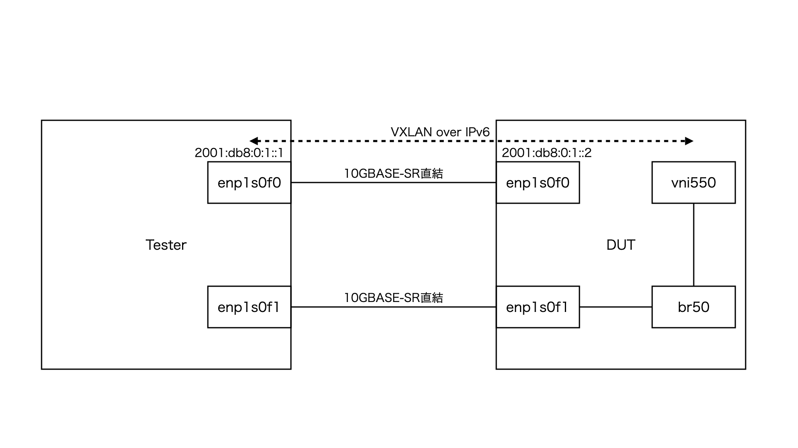
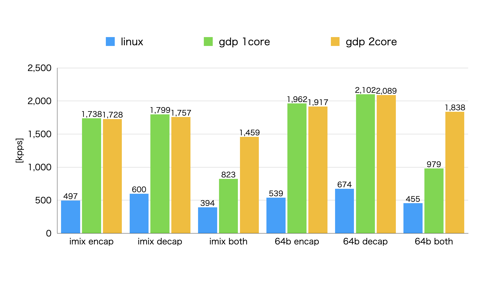
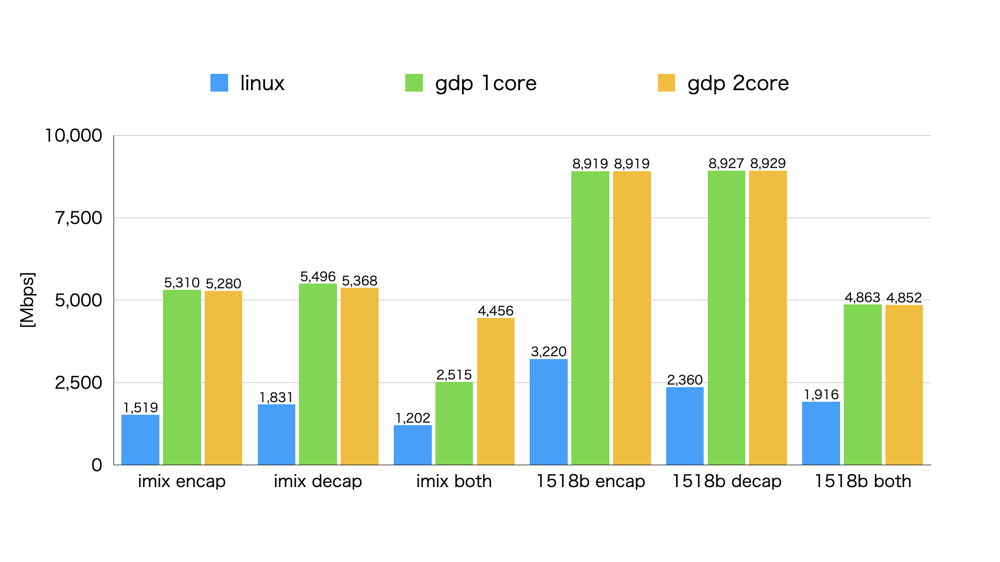
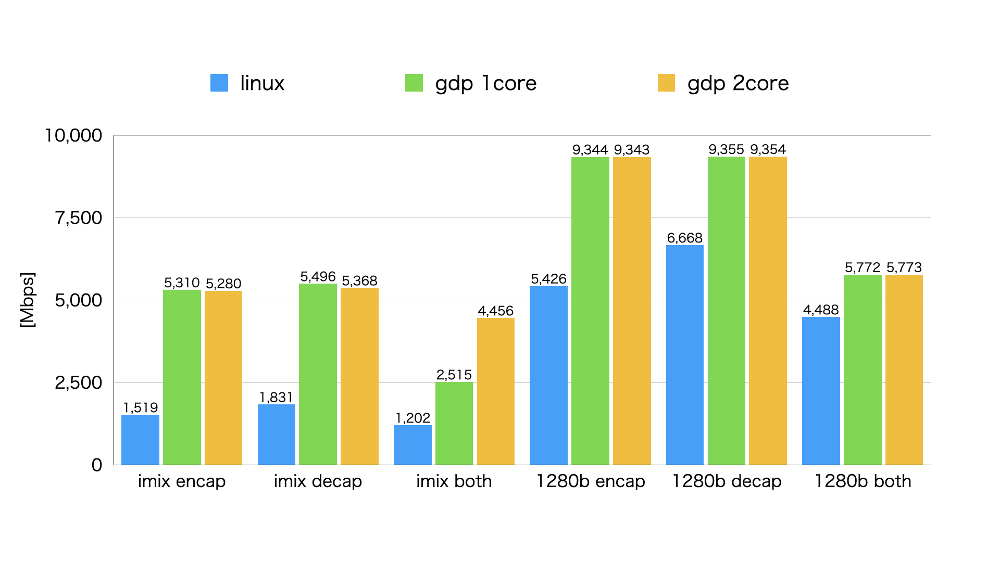
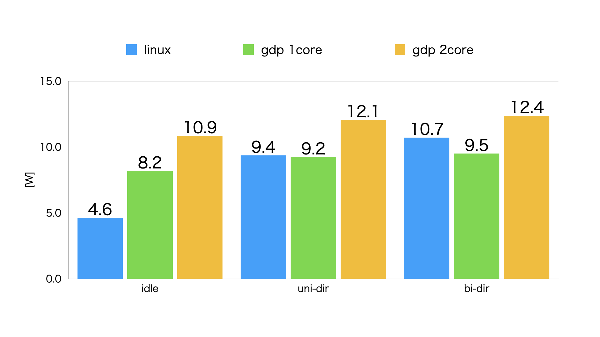

# ベンチマーク試験結果

VXLAN over IPv6 を Linux カーネルで処理した場合と gdp で処理した場合のベンチマーク試験の結果です。

## 試験環境構成

ベンチマーク試験は以下の構成で行いました。



Ethernet フレームを VXLAN over IPv6 にエンキャップする処理は Tester の `enp1s0f1` から Ethernet フレームを送信し DUT で VXLAN over IPv6 にエンキャップされたものが Tester の `enp1s0f0` で受信されます。

VXLAN over IPv6 をデキャップする処理は Tester の `enp1s0f0` から VXLAN over IPv6 パケットを送信し DUT でデキャップされたものが Tester の `enp1s0f1` で受信されます。

Tester のプログラムには [Cisco TRex](https://trex-tgn.cisco.com/ "Cisco TRex") を用いました。
テストスクリプトは [ここ](./scripts/tester/ "ここ") に置いてあります。

10Gbps のインターフェースなので、まず 10Gbps でパケットを 30 秒間流し、 1 つでもパケットを落としたらその半分の 5Gbps で試し、ダメだったらさらにその半分、 1 つも落とさなかったら OK だった 5Gbps と前回ダメだった 10Gbps の半分の 7.5Gbps で試し、、という 2 分探索を 15 回繰り返すことで 1 パケットも落とさない最も多く流せる量を探しています。ただしソフトウェア処理で変な割り込みがちょっとでも入るとパケットを落としてしまうので 1 回試してダメでももう一回同じ量で試し OK だったら OK ということにする、ということにしています。

流すパケットのパターンとしては以下の 8 パターンで実施しました。

* imix
* udp64b
* udp128b
* udp256b
* udp512b
* udp1024b
* udp1280b
* udp1518b

udpXb は Ethernet ヘッダと FCS も含めて X バイトの UDP データグラムを流すものです。

imix は udp64b と udp594b と udp1518b を 7 : 4 : 1 の割合で流すものです。

流す方向のパターンとしては以下の 3 パターンで実施しました。

* encap
* decap
* both

encap は udp64b, udp128b, udp256b ... の Ethernet フレームを VXLAN over IPv6 でエンキャップする際のテストです。

decap は逆にそれらをデキャップし Ethernet フレームに戻す際のテストです。

both は encap と decap を同じ転送レートで同時に流すテストです。
以下、試験結果で both が X Mbps と表示されている時は X Mbps 分のデータが相互に流れていることを意味します。
つまり both で X Mbps といった場合、実際には全体で X の 2 倍流れていることになります。

gdp は 1 コアで 2 ポート分を処理させるパターン(CPU 使用率が 100% で張り付くようなイメージ)と 1 コアで 1 ポート分を処理させるパターン(CPU 使用率が 200% で張り付くようなイメージ)の 2 パターンで試しました。

Tester と DUT 共にハードウェアは [こちら](https://www.toptonpc.com/product/12th-gen-firewall-mini-pc-2x10g-sfp-2xi226-v-2-5g-intel-i3-n305-n100-soft-router/) で行いました。

`/proc/cpuinfo` は以下の通りです(引用は 1 コア分のみで同様のものが 4 コア分)。

```text
processor	: 0
vendor_id	: GenuineIntel
cpu family	: 6
model		: 190
model name	: Intel(R) N100
stepping	: 0
microcode	: 0x1c
cpu MHz		: 2925.072
cache size	: 6144 KB
physical id	: 0
siblings	: 4
core id		: 0
cpu cores	: 4
apicid		: 0
initial apicid	: 0
fpu		: yes
fpu_exception	: yes
cpuid level	: 32
wp		: yes
flags		: fpu vme de pse tsc msr pae mce cx8 apic sep mtrr pge mca cmov pat pse36 clflush dts acpi mmx fxsr sse sse2 ss ht tm pbe syscall nx pdpe1gb rdtscp lm constant_tsc art arch_perfmon pebs bts rep_good nopl xtopology nonstop_tsc cpuid aperfmperf tsc_known_freq pni pclmulqdq dtes64 monitor ds_cpl vmx est tm2 ssse3 sdbg fma cx16 xtpr pdcm sse4_1 sse4_2 x2apic movbe popcnt tsc_deadline_timer aes xsave avx f16c rdrand lahf_lm abm 3dnowprefetch cpuid_fault epb cat_l2 cdp_l2 ssbd ibrs ibpb stibp ibrs_enhanced tpr_shadow flexpriority ept vpid ept_ad fsgsbase tsc_adjust bmi1 avx2 smep bmi2 erms invpcid rdt_a rdseed adx smap clflushopt clwb intel_pt sha_ni xsaveopt xsavec xgetbv1 xsaves split_lock_detect user_shstk avx_vnni dtherm ida arat pln pts hwp hwp_notify hwp_act_window hwp_epp hwp_pkg_req vnmi umip pku ospke waitpkg gfni vaes vpclmulqdq rdpid movdiri movdir64b fsrm md_clear serialize arch_lbr ibt flush_l1d arch_capabilities
vmx flags	: vnmi preemption_timer posted_intr invvpid ept_x_only ept_ad ept_1gb flexpriority apicv tsc_offset vtpr mtf vapic ept vpid unrestricted_guest vapic_reg vid ple shadow_vmcs ept_mode_based_exec tsc_scaling usr_wait_pause
bugs		: spectre_v1 spectre_v2 spec_store_bypass swapgs rfds bhi
bogomips	: 1612.80
clflush size	: 64
cache_alignment	: 64
address sizes	: 39 bits physical, 48 bits virtual
power management:
```

`lspci -vt` の結果は以下の通りです。

```text
-[0000:00]-+-00.0  Intel Corporation Device 461c
           +-02.0  Intel Corporation Alder Lake-N [UHD Graphics]
           +-0d.0  Intel Corporation Device 464e
           +-14.0  Intel Corporation Alder Lake-N PCH USB 3.2 xHCI Host Controller
           +-14.2  Intel Corporation Alder Lake-N PCH Shared SRAM
           +-16.0  Intel Corporation Alder Lake-N PCH HECI Controller
           +-17.0  Intel Corporation Device 54d3
           +-1c.0-[01]--+-00.0  Intel Corporation 82599ES 10-Gigabit SFI/SFP+ Network Connection
           |            \-00.1  Intel Corporation 82599ES 10-Gigabit SFI/SFP+ Network Connection
           +-1c.6-[02]----00.0  Intel Corporation Ethernet Controller I226-V
           +-1d.0-[03]----00.0  Intel Corporation Ethernet Controller I226-V
           +-1d.3-[04]----00.0  Transcend Information, Inc. NVMe PCIe SSD 110Q (DRAM-less)
           +-1f.0  Intel Corporation Alder Lake-N PCH eSPI Controller
           +-1f.3  Intel Corporation Alder Lake-N PCH High Definition Audio Controller
           +-1f.4  Intel Corporation Device 54a3
           \-1f.5  Intel Corporation Device 54a4
```

82599ES の `lspci -vv` の結果は以下の通りです(1 個目分のみ)。

```text
01:00.0 Ethernet controller: Intel Corporation 82599ES 10-Gigabit SFI/SFP+ Network Connection (rev 01)
	Control: I/O+ Mem+ BusMaster+ SpecCycle- MemWINV- VGASnoop- ParErr- Stepping- SERR- FastB2B- DisINTx-
	Status: Cap+ 66MHz- UDF- FastB2B- ParErr- DEVSEL=fast >TAbort- <TAbort- <MAbort- >SERR- <PERR- INTx-
	Latency: 0, Cache Line Size: 64 bytes
	Interrupt: pin A routed to IRQ 16
	IOMMU group: 11
	Region 0: Memory at 80920000 (64-bit, non-prefetchable) [size=128K]
	Region 2: I/O ports at 3020 [size=32]
	Region 4: Memory at 80944000 (64-bit, non-prefetchable) [size=16K]
	Capabilities: [40] Power Management version 3
		Flags: PMEClk- DSI+ D1- D2- AuxCurrent=0mA PME(D0+,D1-,D2-,D3hot+,D3cold-)
		Status: D0 NoSoftRst- PME-Enable- DSel=0 DScale=1 PME-
	Capabilities: [50] MSI: Enable- Count=1/1 Maskable+ 64bit+
		Address: 0000000000000000  Data: 0000
		Masking: 00000000  Pending: 00000000
	Capabilities: [70] MSI-X: Enable+ Count=64 Masked-
		Vector table: BAR=4 offset=00000000
		PBA: BAR=4 offset=00002000
	Capabilities: [a0] Express (v2) Endpoint, MSI 00
		DevCap:	MaxPayload 512 bytes, PhantFunc 0, Latency L0s <512ns, L1 <64us
			ExtTag- AttnBtn- AttnInd- PwrInd- RBE+ FLReset+ SlotPowerLimit 0W
		DevCtl:	CorrErr- NonFatalErr- FatalErr- UnsupReq-
			RlxdOrd+ ExtTag- PhantFunc- AuxPwr- NoSnoop+ FLReset-
			MaxPayload 256 bytes, MaxReadReq 512 bytes
		DevSta:	CorrErr- NonFatalErr- FatalErr- UnsupReq- AuxPwr- TransPend-
		LnkCap:	Port #0, Speed 5GT/s, Width x8, ASPM L0s, Exit Latency L0s unlimited
			ClockPM- Surprise- LLActRep- BwNot- ASPMOptComp-
		LnkCtl:	ASPM Disabled; RCB 64 bytes, Disabled- CommClk+
			ExtSynch- ClockPM- AutWidDis- BWInt- AutBWInt-
		LnkSta:	Speed 5GT/s, Width x4 (downgraded)
			TrErr- Train- SlotClk+ DLActive- BWMgmt- ABWMgmt-
		DevCap2: Completion Timeout: Range ABCD, TimeoutDis+ NROPrPrP- LTR-
			 10BitTagComp- 10BitTagReq- OBFF Not Supported, ExtFmt- EETLPPrefix-
			 EmergencyPowerReduction Not Supported, EmergencyPowerReductionInit-
			 FRS- TPHComp- ExtTPHComp-
			 AtomicOpsCap: 32bit- 64bit- 128bitCAS-
		DevCtl2: Completion Timeout: 50us to 50ms, TimeoutDis- LTR- 10BitTagReq- OBFF Disabled,
			 AtomicOpsCtl: ReqEn-
		LnkCtl2: Target Link Speed: 5GT/s, EnterCompliance- SpeedDis-
			 Transmit Margin: Normal Operating Range, EnterModifiedCompliance- ComplianceSOS-
			 Compliance Preset/De-emphasis: -6dB de-emphasis, 0dB preshoot
		LnkSta2: Current De-emphasis Level: -6dB, EqualizationComplete- EqualizationPhase1-
			 EqualizationPhase2- EqualizationPhase3- LinkEqualizationRequest-
			 Retimer- 2Retimers- CrosslinkRes: unsupported
	Capabilities: [e0] Vital Product Data
		Unknown small resource type 06, will not decode more.
	Capabilities: [100 v1] Advanced Error Reporting
		UESta:	DLP- SDES- TLP- FCP- CmpltTO- CmpltAbrt- UnxCmplt- RxOF- MalfTLP- ECRC- UnsupReq- ACSViol-
		UEMsk:	DLP- SDES- TLP- FCP- CmpltTO- CmpltAbrt- UnxCmplt- RxOF- MalfTLP- ECRC- UnsupReq- ACSViol-
		UESvrt:	DLP+ SDES- TLP- FCP+ CmpltTO- CmpltAbrt- UnxCmplt- RxOF+ MalfTLP+ ECRC- UnsupReq- ACSViol-
		CESta:	RxErr- BadTLP- BadDLLP- Rollover- Timeout- AdvNonFatalErr+
		CEMsk:	RxErr- BadTLP- BadDLLP- Rollover- Timeout- AdvNonFatalErr+
		AERCap:	First Error Pointer: 00, ECRCGenCap+ ECRCGenEn- ECRCChkCap+ ECRCChkEn-
			MultHdrRecCap- MultHdrRecEn- TLPPfxPres- HdrLogCap-
		HeaderLog: 00000000 00000000 00000000 00000000
	Capabilities: [140 v1] Device Serial Number a8-b8-e0-ff-ff-05-97-d5
	Capabilities: [150 v1] Alternative Routing-ID Interpretation (ARI)
		ARICap:	MFVC- ACS-, Next Function: 1
		ARICtl:	MFVC- ACS-, Function Group: 0
	Capabilities: [160 v1] Single Root I/O Virtualization (SR-IOV)
		IOVCap:	Migration- 10BitTagReq- Interrupt Message Number: 000
		IOVCtl:	Enable- Migration- Interrupt- MSE- ARIHierarchy+ 10BitTagReq-
		IOVSta:	Migration-
		Initial VFs: 64, Total VFs: 64, Number of VFs: 0, Function Dependency Link: 00
		VF offset: 128, stride: 2, Device ID: 10ed
		Supported Page Size: 00000553, System Page Size: 00000001
		Region 0: Memory at 0000004017000000 (64-bit, prefetchable)
		Region 3: Memory at 0000004017100000 (64-bit, prefetchable)
		VF Migration: offset: 00000000, BIR: 0
	Kernel driver in use: vfio-pci
	Kernel modules: ixgbe
```

Tester の OS は CentOS 7 で DUT の OS は Ubuntu 24.04 です。

DUT のセットアップスクリプトは [ここ](./scripts/dut/ "ここ") に置いてあります。

## 結果

最初に 1 秒間あたりどれくらいのパケットを処理できるかを表す PPS 性能のグラフです。
PPS 性能はロングパケットでは帯域で頭打ちとなり面白くないので imix とショートパケットの udp64b のみ抜粋します。



imix では Linux カーネルに対して 3 倍程度の性能となりました。
エンキャップとデキャップを両方実施するパターンでは gdp 1core より gdp 2core の方が良くなっていますが、
これはエンキャップとデキャップは受信ポート側を処理する CPU でしか処理されないためです。
エンキャップとデキャップを同時に流す場合 gdp 2core はそれぞれの処理を並列して実行できるのでその分性能が良くなります。

次に 1 秒間あたりにそれくらいのビット数を処理できるかを表す BPS 性能のグラフです。
最初に imix と udp1518b のみを抜粋したものです。



udp1518b ではエンキャップとデキャップ共に Linux カーネルに対して 3 倍程度の性能となりました。
VXLAN over IPv6 で udp1518b を送受信しようとした場合、エンキャップの際はフラグメント処理が、デキャップの際はリアセンブル処理が、それぞれ生ずるため処理としては重めとなります。
そのためフラグメントとリアセンブルが生じない udp1280b の性能も見ておいた方が良いと思います。

ということで次は imix と udp1280 のみを抜粋した BPS 性能のグラフです。



Linux カーネルでの性能がかなり良くなっています。やはりフラグメントとリアセンブルはかなり重いようです。

gdp での性能も udp1518b に対して udp1280b の方が良くなっていますが、これはフラグメントした際の IPv6 ヘッダと UDP ヘッダと VXLAN ヘッダのオーバーヘッド分のような気がします。

総ずると、
Linux カーネルでは 1Gbps 程度、
1core の gdp では 2Gbps 程度、
2core の gdp では 4Gbps 程度、
はそれぞれ安定して転送できるのではないかと思います。
安定して、というのは「一切パケットを落とすことなく」といった意味です。
おそらく実際に TCP の試験を行うと上記以上の性能が出るのではないかと思います。

ちなみにエンキャップとデキャップを同時に流した際の性能が悪くなっているのはおそらく PCIe 帯域の問題なのではないかという気がします。
冒頭で引用した通り 82599ES は 5GT/s x 8 で接続できるはずなのに 5GT/s x 4 で接続されており、その辺が原因かもしれません。

```text
                LnkCap: Port #0, Speed 5GT/s, Width x8, ASPM L0s, Exit Latency L0s unlimited
                        ClockPM- Surprise- LLActRep- BwNot- ASPMOptComp-
                LnkCtl: ASPM Disabled; RCB 64 bytes, Disabled- CommClk+
                        ExtSynch- ClockPM- AutWidDis- BWInt- AutBWInt-
                LnkSta: Speed 5GT/s, Width x4 (downgraded)
                        TrErr- Train- SlotClk+ DLActive- BWMgmt- ABWMgmt-
```

ちなみに `turbostat` コマンドで CPU パッケージの消費電力を調べると以下のようになっていました。



gdp はパケットが何も流れていない時も NIC にパケットが届いていないか調べ続けるためアイドル状態の消費電力は Linux に比べ多くなります。
そして当然その分、発熱もあります。
